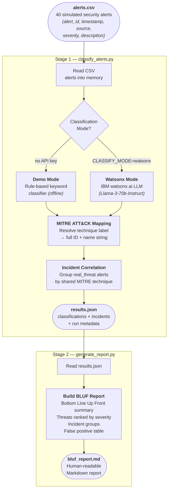

# Architecture — NullThreat Alert Classifier

## Overview

NullThreat is a two-stage AI pipeline that ingests raw security alerts, classifies
each one as a **real threat** or **false positive**, maps confirmed threats to
**MITRE ATT&CK techniques**, correlates related alerts into **incident groups**,
and produces a **BLUF-style Markdown report** ready for an analyst to act on.

The pipeline runs entirely from the command line with no server, no database, and
no UI required — making it fast to demo and easy to understand end-to-end.

---

## Data Flow Diagram



---

## Components

| Component | File | Technology | Responsibility |
|---|---|---|---|
| Alert Dataset | `src/data/alerts.csv` | CSV | 40 simulated defense security alerts across 4 source types and 4 severity levels |
| Classifier | `src/classify_alerts.py` | Python 3 | Reads alerts, classifies each one, maps to MITRE ATT&CK, correlates incidents, writes JSON |
| Rule Engine _(demo)_ | `classify_alerts.py` | Pure Python | 25-rule keyword matcher — classifies alerts offline with no API key |
| LLM Classifier _(live)_ | `classify_alerts.py` | IBM watsonx.ai SDK | Zero-shot prompt to `meta-llama/llama-3-3-70b-instruct` for AI-powered classification |
| MITRE Mapper | `classify_alerts.py` | Python dict | Resolves short technique labels (e.g. `phishing`) → full ATT&CK strings (e.g. `T1566 - Phishing`) |
| Incident Correlator | `classify_alerts.py` | Python | Groups `real_threat` alerts by shared MITRE technique into named incident clusters |
| Report Generator | `src/generate_report.py` | Python 3 | Reads `results.json`, builds a BLUF Markdown report ranked by severity |
| Output — JSON | `src/output/results.json` | JSON | Machine-readable classification results, incident groups, and run metadata |
| Output — Report | `src/output/bluf_report.md` | Markdown | Analyst-facing BLUF report with threat table, incident groups, and false positive log |

---

## Detailed Data Flow

1. **Ingest** — `classify_alerts.py` reads `src/data/alerts.csv` row-by-row into a
   list of Python dicts. Each row represents one security alert with fields:
   `alert_id`, `timestamp`, `source_system`, `severity`, `description`.

2. **Classify** — Each alert is passed to the active classifier:
   - **Demo mode** (default): a list of 25 keyword rules scans the `description`
     field. The first matching keyword determines the classification and MITRE label.
     No network call is made.
   - **Watsonx mode** (`CLASSIFY_MODE=watsonx` in `.env`): a zero-shot prompt is
     sent to IBM watsonx.ai. The model returns a small JSON object with
     `classification`, `confidence`, `mitre_label`, and `reason`. The response is
     parsed and normalised into the same dict shape as the demo classifier.

3. **MITRE Mapping** — The `mitre_label` string (e.g. `"credential_dumping"`) is
   looked up in the `MITRE_TECHNIQUES` dict to resolve the full ATT&CK identifier
   (e.g. `"T1003 - OS Credential Dumping"`).

4. **Correlation** — All `real_threat` alerts are grouped by `mitre_label`. Each
   group becomes one incident (`INC-001`, `INC-002`, …) with a `severity_max` field
   reflecting the worst alert in the group.

5. **Serialise** — A `results.json` file is written with three top-level keys:
   `run_metadata`, `alerts` (all 40 classified records), and `incidents` (the
   correlated groups).

6. **Report** — `generate_report.py` loads `results.json` and renders a
   BLUF Markdown document:
   - A 2–3 sentence bottom-line summary (total alerts, threat count, top incident)
   - A severity-ranked confirmed threats table with MITRE mappings
   - An incident groups section showing correlated alert clusters
   - A false positives table for audit purposes
   - Summary statistics (signal-to-noise ratio, highest severity, etc.)

---

## MITRE ATT&CK Techniques Covered

| Label | Technique ID | Full Name |
|---|---|---|
| `phishing` | T1566 | Phishing |
| `valid_accounts` | T1078 | Valid Accounts |
| `application_protocol` | T1071 | Application Layer Protocol |
| `lateral_movement_smb` | T1021.002 | Remote Services: SMB/Windows Admin Shares |
| `credential_dumping` | T1003 | OS Credential Dumping |
| `powershell` | T1059.001 | Command and Scripting Interpreter: PowerShell |
| `data_exfiltration` | T1041 | Exfiltration Over C2 Channel |
| `usb_exfil` | T1052.001 | Exfiltration Over Physical Medium: USB |
| `exploit_public_app` | T1190 | Exploit Public-Facing Application |
| `privilege_escalation` | T1068 | Exploitation for Privilege Escalation |

---

## Mode Switching

The classifier supports two modes controlled by the `CLASSIFY_MODE` environment variable:

```
# src/.env
CLASSIFY_MODE=demo      # default — offline rule-based, no credentials needed
CLASSIFY_MODE=watsonx   # calls IBM watsonx.ai LLM (requires API key + project ID)
```

Both modes produce **identical output shapes** — the rest of the pipeline
(`generate_report.py`) is completely unaware of which mode was used.

---

## Security Considerations

- API keys and project IDs are loaded from a `.env` file that is listed in
  `.gitignore` — they are never committed to source control.
- `src/.env.example` is provided as a safe credential template with placeholder values.
- In demo mode, **no network calls are made at all** — the tool is fully air-gappable.
- Alert descriptions contain simulated data only — no real PII or classified content.

---

## Scalability Notes

This is a hackathon prototype. To scale it toward production:

| Bottleneck | Production approach |
|---|---|
| Sequential alert processing | Parallelise API calls with `asyncio` + `aiohttp` or a thread pool |
| Flat CSV input | Replace with a SIEM API feed (e.g. IBM QRadar, Splunk) or a Kafka topic |
| Rule-based demo classifier | Tune a watsonx.ai Granite model on labelled threat data for higher accuracy |
| Single JSON output file | Write to a database (PostgreSQL / Db2) for historical querying and dashboards |
| Manual report generation | Schedule via cron or trigger automatically on new alert batches |
