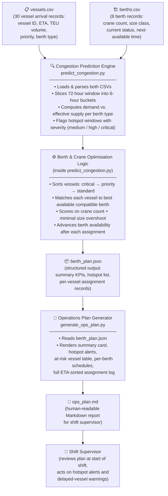

# Architecture — Container Congestion Predictor & Port Operations Optimiser

This document describes how the system is built, how data moves through it, and
what would need to change to take it from a working prototype to a production
deployment at a real container port.

---

## System Data Flow

The diagram below traces a piece of data from the moment it enters the system as
a raw CSV row through to the final operations plan that lands in a shift
supervisor's hands.

---

## Component Table

| Component | File | Responsibility | Technology |
|-----------|------|----------------|------------|
| Vessel schedule data | `src/data/vessels.csv` | Holds simulated inbound vessel records: arrival time, cargo volume in TEU, priority tier, and requested berth type | CSV (flat file) |
| Berth capacity data | `src/data/berths.csv` | Holds the current state of each berth: crane count, maximum vessel size, occupancy status, and when it next becomes free | CSV (flat file) |
| Congestion Prediction Engine | `src/predict_congestion.py` — `predict_congestion()` | Divides the 72-hour window into 6-hour slices, counts arriving vessels versus effective berth supply for each berth type, and flags any slice where demand exceeds supply as a congestion hotspot | Python 3 (stdlib only: `csv`, `json`, `datetime`, `collections`) |
| Berth & Crane Optimisation Logic | `src/predict_congestion.py` — `assign_berths()` | Assigns every inbound vessel to the most suitable free berth, working through vessels in priority order so critical cargo is never blocked by routine traffic. Prefers berths with more cranes and penalises unnecessary size over-allocation | Python 3 (stdlib only) |
| Assignment plan output | `src/output/berth_plan.json` | Machine-readable record of every assignment decision, congestion hotspots, KPI summary, and any vessels that could not be placed. The single source of truth passed to the report generator | JSON |
| Operations Plan Generator | `src/generate_ops_plan.py` | Reads `berth_plan.json` and renders six clearly labelled sections into a Markdown document: header KPIs, hotspot alerts with action recommendations, vessels-at-risk table, per-berth timetables, full ETA-sorted log, and unassigned vessel warnings | Python 3 (stdlib only: `json`, `os`, `datetime`, `collections`) |
| Operations plan report | `src/output/ops_plan.md` | The final human-readable deliverable. Formatted for a shift supervisor: plain language, no jargon, actionable recommendations next to every alert | Markdown |

---

## End-to-End Data Flow

Here is a plain-language walkthrough of exactly what happens from raw input to
finished report.

**Step 1 — Load the raw data**
`predict_congestion.py` opens `vessels.csv` and `berths.csv`. Each row is
parsed into a Python dictionary. Timestamps are converted to `datetime` objects
so that time arithmetic (e.g. "is this berth free *before* this vessel arrives?")
works correctly. Integer fields such as TEU volume and crane count are cast from
strings to numbers.

**Step 2 — Slice the planning window**
The 72-hour planning window is anchored to the earliest vessel ETA in the
dataset. It is then divided into twelve 6-hour buckets. Using the earliest ETA
as the anchor (rather than wall-clock time) means the analysis always covers
exactly the period the port cares about.

**Step 3 — Predict congestion hotspots**
For each 6-hour bucket the engine counts:
- **Demand:** how many vessels are arriving, grouped by their requested berth type (`general`, `deep_water`, `shallow_water`)
- **Effective supply:** how many compatible berths are available, weighted by when they become free (1.0 if free at the bucket start; 0.5 if they free up partway through; 0 if still occupied)

If demand exceeds effective supply for any berth type, that bucket is flagged as
a hotspot. Severity is `medium` (ratio ≥ 1.33), `high` (≥ 1.5), or `critical`
(≥ 2.0, or zero berths free). Each hotspot record includes a utilisation ratio
and a plain-language supervisor action recommendation.

**Step 4 — Optimise berth assignments**
Vessels are sorted into three tiers — critical, priority, standard — and within
each tier by earliest ETA. The engine then works through the sorted list one
vessel at a time:
1. Filter candidate berths to those compatible with the vessel's requested type and not in maintenance.
2. Prefer berths that are already free before the vessel's ETA ("ready" candidates) over those that require a wait.
3. Among ready berths, pick the one with the most cranes (fastest cargo handling) and the smallest size class that still fits (preserving large berths for large vessels that come later).
4. For critical vessels only: if no berth is immediately free, accept a short wait and take the soonest-available compatible berth.
5. After each assignment, advance that berth's `next_available_time` by 8 hours (the modelled service duration), so every subsequent vessel in the loop sees the correct updated state.

**Step 5 — Write `berth_plan.json`**
All hotspot records, assignment records, unassigned vessel records, and a
summary KPI block are serialised to JSON and written to
`src/output/berth_plan.json`. This file is the handoff point between the two
scripts — it captures the full machine-readable result of the prediction and
optimisation work.

**Step 6 — Generate the operations plan**
`generate_ops_plan.py` reads `berth_plan.json` and builds six Markdown sections:
- **Summary card** — headline metrics (total vessels, assigned, delayed, hotspots)
- **Hotspot alerts** — one block per congestion window with severity badge, demand/supply figures, and action recommendation
- **Vessels at risk** — all delayed vessels sorted by longest wait first, so the supervisor's attention goes to the worst cases immediately
- **Berth schedules** — one table per berth in service order, designed to be printed and pinned at the berth station
- **Full assignment log** — every vessel by ETA with ON SCHEDULE / DELAYED status
- **Unassigned vessels** — any vessels that could not be placed, flagged as requiring immediate operator action

The completed document is written to `src/output/ops_plan.md`.

**Step 7 — Supervisor review**
The shift supervisor opens `ops_plan.md` at the start of their shift. The
document is self-contained: no tooling, no dashboard, no login required. They
read the hotspot alerts at the top, check the at-risk vessel table, then refer
to individual berth schedules as needed throughout the shift.

---

## Security Notes

- **No real operational data.** All vessel records and berth records are
  fully simulated. No actual port, shipping line, cargo manifest, or vessel
  identity data is present anywhere in this repository.
- **No external network calls.** Both scripts run entirely offline. They read
  local files and write local files. There are no HTTP requests, no API keys,
  no webhooks, and no third-party service dependencies.
- **No credentials in the repository.** The `.gitignore` excludes `.env` files,
  key files, and secrets directories. Neither script requires any authentication
  or configuration secrets to run.
- **No user-supplied input at runtime.** File paths are defined as constants
  inside each script. There is no command-line argument parsing that could be
  exploited with malformed input.

---

## Scalability Notes

The current prototype is intentionally simple: two CSV files in, one JSON file
and one Markdown file out. Below is an honest assessment of what would need to
change at each layer to handle a real port's operational data volume.

| Concern | Current (prototype) | Production path |
|---------|--------------------|-----------------------|
| **Data input** | Static CSV files with 30 vessels and 8 berths, refreshed manually | Replace CSV readers with a live data connector — e.g. a port community system (PCS) API or an AIS (Automatic Identification System) feed — so vessel ETAs and berth states are updated in real time |
| **Planning window** | Fixed 72-hour look-ahead, anchored to the earliest ETA in the file | Anchor to the current wall-clock time and re-run on a schedule (e.g. every 15 minutes via a cron job or event trigger) |
| **Berth count & vessel volume** | 8 berths, 30 vessels | The core algorithm scales linearly with vessel count; a real large port might have 50–100 active berths and hundreds of vessel movements per week, which this approach handles without structural changes |
| **Service time model** | Fixed 8-hour service duration for every vessel | Replace the constant with a TEU-volume ÷ (crane-count × crane-throughput-rate) formula for realistic, vessel-specific estimates |
| **Historical tracking** | No history — each run is independent | Add a lightweight database (e.g. SQLite for a single-server deployment, PostgreSQL for multi-user) to store assignment history, track hotspot recurrence, and feed a future prediction model |
| **Output delivery** | Markdown file written to disk | Render `ops_plan.md` to HTML or PDF and push to an internal portal or email distribution list at the start of each shift automatically |
| **Concurrency** | Single-process, sequential | If running continuously against a live feed, wrap the prediction and assignment steps in async tasks or a simple job queue so a slow data pull does not block the report generation |

---

*Document covers: `src/data/vessels.csv`, `src/data/berths.csv`,
`src/predict_congestion.py`, `src/generate_ops_plan.py`,
`src/output/berth_plan.json`, `src/output/ops_plan.md`*
